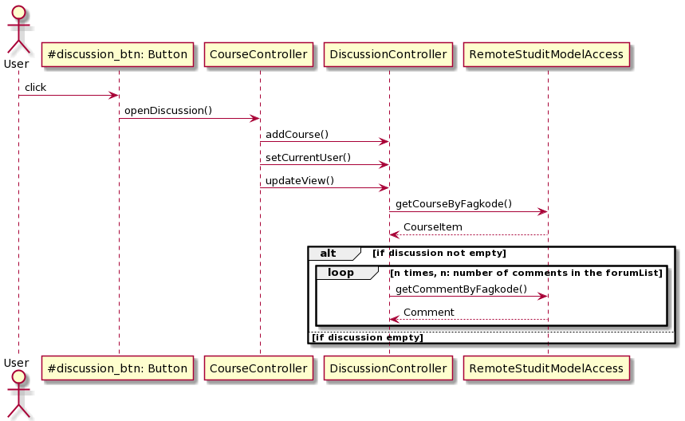

# UI-module (fxui)
In this directory you can find the files related to the UI-module. Under src/main you can find the JavaFX-code and FXML-files realted and under src/test you can find the tests for this layer.

## UI-layer
The UI-layer consists of all classes and logic related to the visualization and actions on the data from the domain-layer. Our UI shows a login screen, a list of selected courses from NTNU, a chatbot, a detailed page about each course and a discussion forum related to each course.
JavaFX and FXML are used for the UI and is founder the studit.ui-package. The JavaFX-code in src/main/java and the FXML-files in src/main/resources).

## Building with maven
Our maven-build is set up with add-ons for java applications in general and with JavaFX in particular (org.openjfx.javafxplugin). 
In addition, we use various code quality analysis tools (jacoco with jacoco, spotbugs with com.github.spotbugs and checkstyle with checkstyle). These are set up so that they do not stop the building unless everything is in order.

## Sequence diagram visualising the relationship between some of the controllers
After you have logged inn and clicked on one of the courses in the main page of StudIt, you can for instance open the discussion of the respective course. The sequence diagram below shows the dynamics of the controllers under the hood. 

