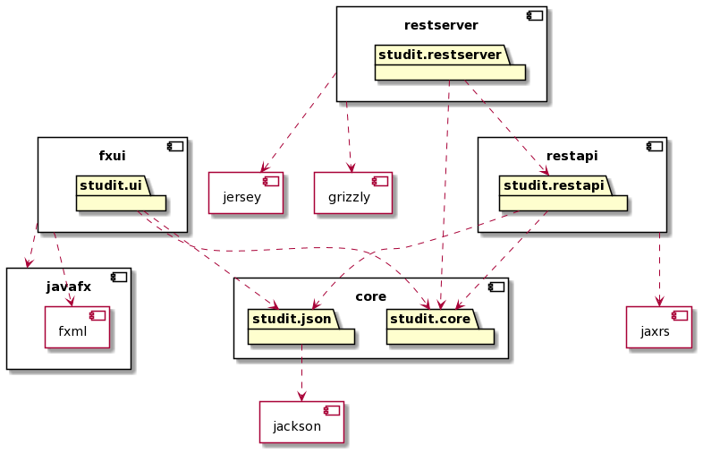

# StudIt - Choose the right course? [NTNU Edition]

* This project is a three-layer application, with domain, user interface (UI) and persistence. The project consists of tests with good coverage and is configured to use **maven** as build tool.

* The project is configured with multiple modules with maven. The domain and persistence layer can be found in the core-module (core) and the user interface in the ui-module (fxui).

## Architecture Diagram

# Class diagram

The purpose of this diagram is to show the functionality of our application, thus we show the most central classes. To display it in the best and most understandable way, we have let out some classes, variables and methods. No setter and getter methods are present, because they don’t serve a significant purpose in understanding the functionality. The choices we have made are explained underneath, and we recommend reading this when looking at the diagram to understand it properly. 

The other classes in the application are not shown in the diagram simply because they are not that necessary to understand the system. E.g the NewUserController or CommentListCell. These classes are only adding extra functionality to the classes shown.

The Chatbot-window can be opened through AppController, CourseController and DiscussionController, however the two latter do it through a method call in AppController, hence there are no associations from them to the Chatbot in the diagram. We find that the extra lines would make the diagram too messy.

There are many ways to draw a class diagram, but we have chosen to show a two-way association with no arrows, and one-way associations with one arrow pointing towards the class accessed. The dotted lines represent dependencies - e.g the DiscussionController can open the CourseController, and vice versa. 

